# Clase 12/07/2024

## JSON en PHP

Convertimos un array a un objeto JSON utilizando `json_encode()` metiendo dentro de los `()` lo que queremos convertir a JSON, para convertir el array en un texto plano "legible"

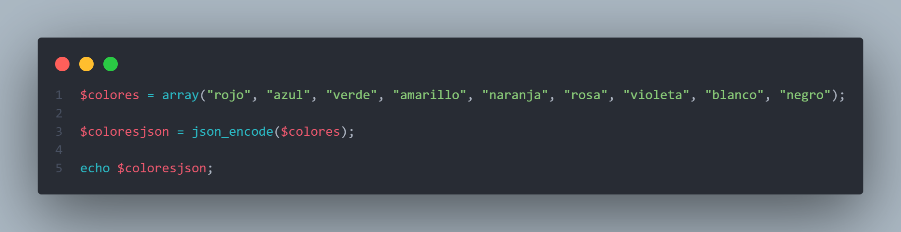

el resultado del echo es este

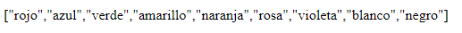

para decodificar el JSON utilizamos `json_decode()`

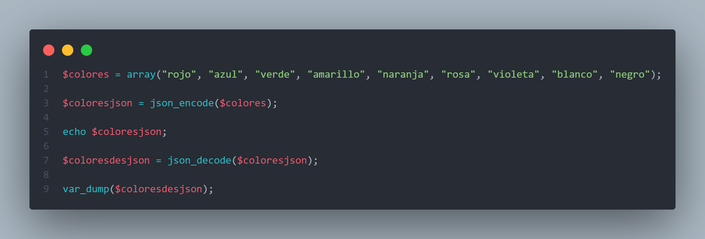

una vez decodificamos, el array pasa a ser un array con su estructura original entonces hay que hacer un `var_dump`, si hacemos un echo nos daría el error de `Cant convert array to string`

## JSON en Jquery

> [!NOTE]
> Todo esto se hace porque desde el PHP a el Jquery que enviamos? un echo, es decir texto plano y que ocurre cuando queremos hacer un echo de un Array? rompe.

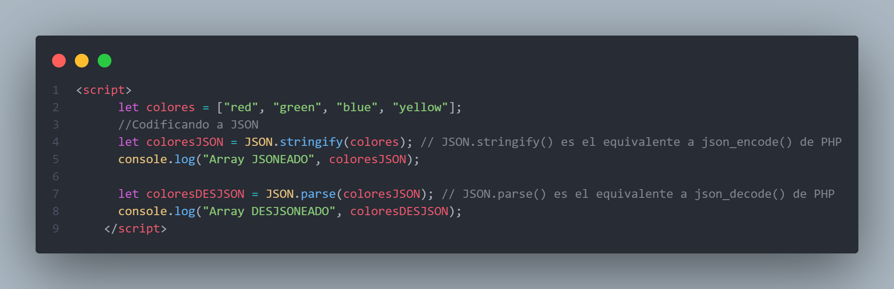

Esto de abajo es lo que aparece en la consola, como resultado de los console.log. 

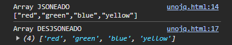

El primer console.log() imprime el texto plano, el array JSONEADO y el segundo console.log() imprime el array en su formato original

### Ejercicio 1, archivos ejercicio1.html y ejercicio1.php

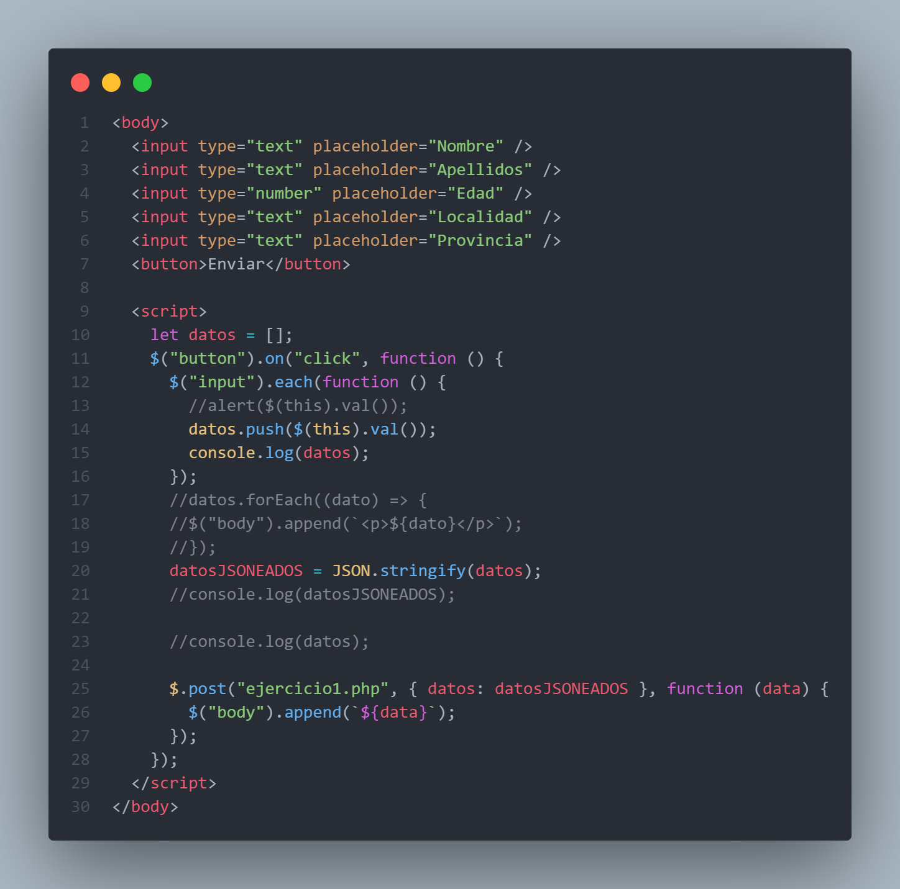

ejercicio1.html -> Creamos un formulario sin etiqueta form, solamente con los inputs que cada uno quiera y un botón, con Jquery seleccionamos los valores de cada input y creamos una escucha para el boton de enviar en la que asignamos que al darle click se pushee a un array vacío todos los datos. Seguido de eso hacemos un `JSON.stringify()` a ese array para así enviarle texto plano al PHP. Y por último creamos la conexión al documento php usando JQuery con el `$post.()`

> [!NOTE]
> A lo que yo le llamo data, es a lo que Alfonso le llamaba echosdelphp que era lo que se pintaba en un .html te dejo un ejemplo abajo

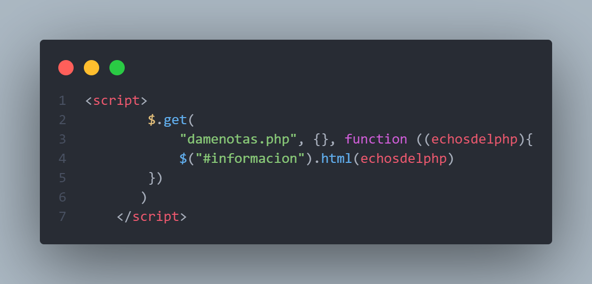

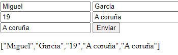

Lo que enviamos es eso, un array convertido a texto plano.

Ahora nos vamos a ejercicio1.php

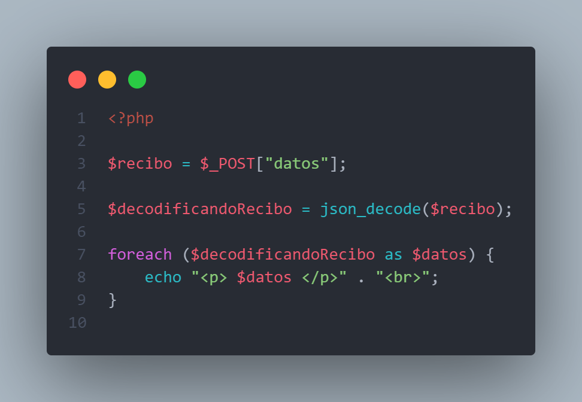

ejercicio1.php -> como vemos, creamos una variable en la que almacenamos lo que recibimos por POST, seguido a eso, como vimos antes enviabamos un array en texto plano por lo que debemos volver a convertirlo a su formato original, entonces, utilizamos `json_decode()` para volver a convertir ese array a su formato original y luego de eso hacemos el respectivo bucle foreach para iterar el array e imprimirlo por pantalla, quedando como resultado esto.

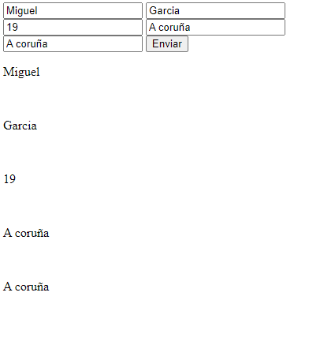

### Ejercicio 2, archivos ejercicio2.html y ejercicio2.php

Realizar en el PHP una consulta de la tabla alumnado y meter solo UNA fila de la respuesta de la consulta en un array y en el HTML pintar ese array en una tabla

Empezamos por el PHP.

Ejercicio2.php ->

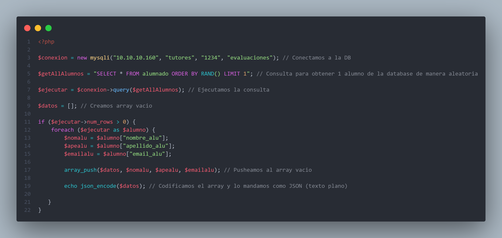

Ejercicio2.html ->

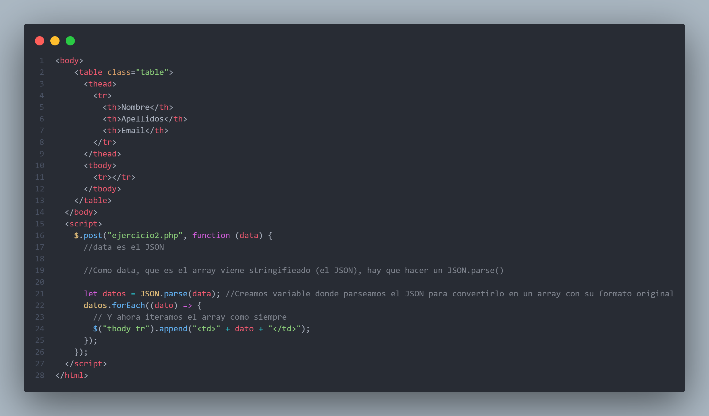

Resultado ->

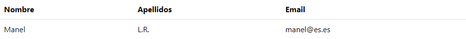

Cada vez que recargamos la pagina, cambia de usuario porque como pusimos RAND() cada vez hace una consulta y devuelve un alumno aleatorio
